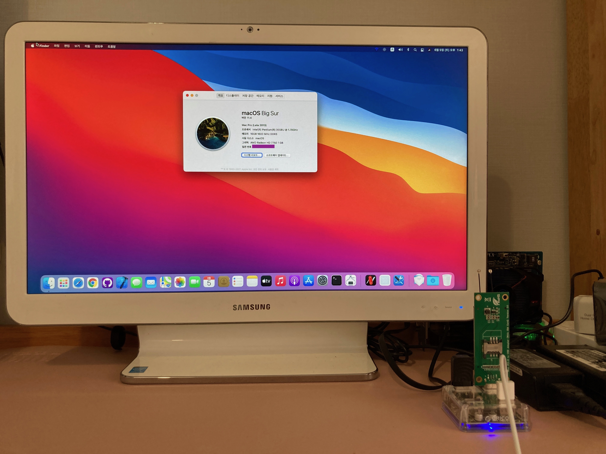
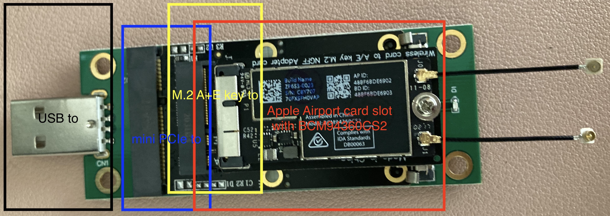

# Samsung ATIV One 5 DM500A2J-K26L Hackintosh

## System specification
| Item | Details |
| - | - |
| Model | Samsung ATIV One 5 DM500A2J-K26L |
| CPU | Intel Pentium 3558U |
| SSD | TeamGroup L5 Lite 3D 240GB *(Replaced stock HDD)* |
| IGPU | Intel HD Graphics (Haswell) *(Disabled from UEFI setup)* |
| DGPU | Sapphire HD 7750 1GB in mini PcIe slot with EXP GDC + half-to-full mini PcIe extension card *(Replaced stock TV tuner card)* |
| RAM | Samsung 8GB x 2 1600 MHz DDR3L SODIMM *(upgraded)* |
| Ethernet | Realtek RTL8168 Gigabit Ethernet Controller |
| Wi-Fi / Bluetooth | No Wi-Fi / BCM20702 Hub from BCM94360CS2 with multiple adapters to USB A *(Disabled stock QCA9565)* |
| Audio | Realtek ALC282 |
| SD Card Reader | Realtek USB Card Reader RTS5129 *(Limited support)* |
| UEFI BIOS | Aptio Setup Utility P05AEK |

##  Before you begin
### Hardware and UEFI mods required
1. eGPU is required for graphics acceleration.
2. UEFI mod is required to route output from iGPU to eGPU at UEFI setup and OpenCore bootpicker.

## UEFI setup
### Using modded Aptio Setup Utility image
1. Learn how to flash AMI UEFI. This may brick the computer, so I don’t recommend it unless you understand the consequences and know how to unbrick in case something goes wrong.
2. [Link to the UEFI mod work](https://www.bios-mods.com/forum/Thread-Request-Unlock-Advanced-and-Chipset-tabs-on-Samsung-All-In-One-DM500A2J) Thanks to genius239 at bios-mods.com
3. Use [this](https://www.supermicro.com/en/products/motherboard/X10SLQ-L) version of Afudos which still has /GAN option to force flash.
- Note: The UEFI setup images in this repository are specifically for DM500A2J-K26L and versioned P05AEK. Please take caution when using these images or use the shell method below.

### Using modified Grub Shell
1. Dump the UEFI using the tool provided in this guide [ASUS G701VI: Unlock Hidden BIOS Settings](https://octoperf.com/blog/2018/11/20/asus-g701vi-bios-unlock/), `1. Software Tools` throgh `2.1 Dumping BIOS`.
2. Follow Dortania's [Fixing CFG Lock](https://dortania.github.io/OpenCore-Post-Install/misc/msr-lock.html) to learn how to find `CFG Lock` register offset and how to use `setup_var`. You can use the same method to also find `Primary Display` offsets.
3. Find `CFG Lock` and `Primary Display` offsets and their setup values.
4. If the DGPU supports UEFI, select `PCIe` in `Primary Display`. If it doesn’t, try updating the VBIOS with Gop driver and select the same option. If the update is limited, set `IGFX` as primary.
    - You will need to switch the monitor's `Source` and set `PC` mode to get into UEFI setup and OpenCore bootpicker if `IGFX` is primary.
5. Disable `CFG Lock`.

## Updating VBIOS with GOP driver
1. Follow the directions found in [this](https://www.win-raid.com/t892f16-AMD-and-Nvidia-GOP-update-No-requests-DIY.html) thread.
- Note 1: This step is only required for dGPUs with legacy ROMs. If you have a model that is manufactured relatively recently, you would not need to follow this step. Check online.
- Note 2: The ROM images in this repository are specifically for Sapphire HD 7750 1GB with device-id 1002:683F and subsystem-id 174B:E213. Follow the update method for your own card.

## Steps to install
1. Read [Configuration.pdf](https://github.com/acidanthera/OpenCorePkg/blob/master/Docs/Configuration.pdf).
2. Read [Dortania guides](https://dortania.github.io/getting-started/).
3. Prepare USB drive with macOS installer mounted on it.
4. Download this repository and copy and paste the OC and BOOT folders to USB EFI partition.
5. Boot into USB and select macOS installer and install.
6. Mount EFI and copy USB EFI to the system EFI partition.
7. Replace the numbers in SMBIOS.

## Other models
If you have a variant such as DM500A2J-K30D, K32D, or K38D, you will notice that the CPU is an i3 model. Lucky you. A lot of fun things could be done.
  1. Delete the kernel patch `Fake CPUID` and enjoy native power management and advanced CPU features.
  2. Inject a working `ig-platform-id` and `SSDT-PNLF` found in OpenCorePkg bundle for working iGPU QE/CI and native brightness control. Test the HDMI-out and configure the framebuffer.
  3. Change `SMBIOS` to iMac14,4 which is an iGPU-only model. You can update to Big Sur with no problem. You still have DRM and sound noise issues.
  4. Insert BCM94360 variants into mini PCIe. There are three antennas on the mainboard: two from Atheros AR9565 / AR3012 and one from TV Tuner Card originally on mini PcIe slot. All share the form factor of U.FL. Although there are many other options, I would recommend BCM943602CS with adapters and U.FL to MHF4 cables, so that both Wi-Fi and Bluetooth are natively supported with full Apple Airport features and full speed. The adapters are shown in [Bluetooth enhancement](#bluetooth-enhancement).
  5. Create an AppleALC layout and fix sound noise.

## Bluetooth enhancement
Atheros AR3012 Bluetooth works okay with Ath3kBT.kext. However, I had a leftover Apple's BCM94360CS2 which can be converted into a USB2 device, where Bluetooth over USB can be used. I bought USB to mini PCIe to M.2 A+E key to Apple Airport card converters, and the Bluetooth works the same way as in a real Mac, such as OS recognition and HID proxy.

## Credits
Apple for macOS

The Acidanthera team for OpenCore and kexts

Other great contributors I have yet to mention
